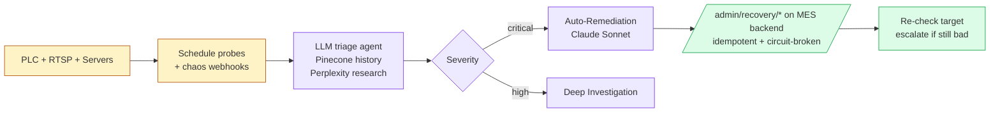

# Autonomous AI Manufacturing Reliability & Infrastructure Protection Platform

An AI-powered self-healing layer for industrial Manufacturing Execution
Systems. Watches every component of a plant deployment (PLCs, RTSP
cameras, ffmpeg recorders, dashboards, databases, network gear, server
processes), reasons about failures using LLM agents with vector memory,
and drives bounded recovery actions through your existing MES backend
— with idempotency, per-target circuit breakers, and a graceful
mock-safe default so the live production line is never put at risk.

Built for the **Toyota Boshoku Device India Bawal plant**, generalizable
to any RTLS + MES stack with an HTTP-callable backend.

---

## What's in the box

| Piece | Where | What it does |
|---|---|---|
| **n8n workflow — zero paid APIs** | [`ops/n8n/workflow.free.json`](ops/n8n/workflow.free.json) | **Recommended for first-time / zero-budget deployments.** Groq (free LLM) + Ollama embeddings (local) + Redis vector + Pinecone free tier + Postgres. 11 credentials. See [`ops/n8n/FREE-STACK.md`](ops/n8n/FREE-STACK.md). |
| **CAPA Generation subworkflow** | [`ops/n8n/workflow.capa.json`](ops/n8n/workflow.capa.json) | Standalone webhook-triggered AI subworkflow: incident → CAPA → Postgres + Slack + email. See [`ops/n8n/CAPA-SHIFT-GUIDE.md`](ops/n8n/CAPA-SHIFT-GUIDE.md). |
| **Shift Intelligence subworkflow** | [`ops/n8n/workflow.shift.json`](ops/n8n/workflow.shift.json) | Schedule-triggered (7/15/23 IST) AI-written shift report. Same guide. |
| **Why-Failed Explainer subworkflow** | [`ops/n8n/workflow.why-failed.json`](ops/n8n/workflow.why-failed.json) | Webhook → plain-language failure narrative + factors + confidence. See [`ops/n8n/PHASE5-FEATURES.md`](ops/n8n/PHASE5-FEATURES.md). |
| **Bottleneck Detector subworkflow** | [`ops/n8n/workflow.bottleneck.json`](ops/n8n/workflow.bottleneck.json) | Every 30 min: AI identifies slowest station + projects 2-hour loss + Slack on confidence. |
| **Knowledge Engine (RAG) subworkflow** | [`ops/n8n/workflow.knowledge-engine.json`](ops/n8n/workflow.knowledge-engine.json) | "Factory ChatGPT" backend: operators ask plain-English questions, answers grounded in past incidents via Pinecone semantic search. |
| **Spare-Part Forecaster subworkflow** | [`ops/n8n/workflow.spare-forecast.json`](ops/n8n/workflow.spare-forecast.json) | Daily 06:00 IST: AI predicts which parts fail next + auto-creates procurement requests. |
| **n8n workflow — paid APIs** | [`ops/n8n/workflow.publish-ready.json`](ops/n8n/workflow.publish-ready.json) | Phase-3 hardening + credential stubs for the original OpenAI + Anthropic + Pinecone + Perplexity stack. 12 credentials. See [`ops/n8n/PUBLISH-READY.md`](ops/n8n/PUBLISH-READY.md). |
| **n8n workflow (no creds)** | [`ops/n8n/workflow.phase3.json`](ops/n8n/workflow.phase3.json) | Bare workflow without any credential stubs — for n8n instances that already have unrelated credentials |
| **Docker stack** | [`docker-compose.yml`](docker-compose.yml) + [`docker/`](docker/) | Postgres + Redis + n8n + Prometheus + Grafana + Loki + Promtail + Ollama. One `docker compose up -d` |
| **Backend recovery patch** | [`backend-patch/`](backend-patch/) | Drop-in FastAPI module: `/admin/recovery/*` routes + idempotency + circuit breaker. Mock-safe by default |
| **Architecture diagrams** | [`ops/ARCHITECTURE.md`](ops/ARCHITECTURE.md) | Mermaid: system, sequence, data-flow, credential matrix, failure-domain isolation |
| **5-minute demo script** | [`ops/DEMO.md`](ops/DEMO.md) | Chaos → AI triage → self-healing → executive summary with exact curl commands |
| **Deployment runbook** | [`ops/MES_PLUS_DEPLOYMENT.md`](ops/MES_PLUS_DEPLOYMENT.md) | Prereqs, secrets, workflow import, real-recovery promotion, backups, SLOs |
| **AI subworkflow specs** | [`ops/n8n/PHASE4B-DESIGN.md`](ops/n8n/PHASE4B-DESIGN.md) | Build-from-spec for CAPA Generation, Shift Intelligence, Root-Cause Correlator, Video Inspection |
| **Per-phase change docs** | [`ops/n8n/PHASE*.md`](ops/n8n/) | Detailed change logs for every workflow edit |

---

## Quick start

```bash
git clone https://github.com/Krishna-44/Autonomous-AI-Manufacturing-Reliability-Infrastructure-Protection-Platform
cd Autonomous-AI-Manufacturing-Reliability-Infrastructure-Protection-Platform
cp .env.example .env
# edit .env — minimum: POSTGRES_PASSWORD, N8N_ENCRYPTION_KEY,
# GRAFANA_ADMIN_PASSWORD, ADMIN_TOKEN, OPENAI_API_KEY

docker compose up -d --build
# (add --profile ai-local to also start Ollama for offline LLM fallback)

# wait ~60s for healthchecks, then:
open http://localhost:5678   # n8n
open http://localhost:3001   # Grafana (admin / your password)
open http://localhost:9090   # Prometheus
```

Import the workflow:

1. n8n → ⋯ → **Import from File** → `ops/n8n/workflow.phase3.json`
2. Bind credentials (one-time, in n8n UI) — see
   [`ops/MES_PLUS_DEPLOYMENT.md` §5](ops/MES_PLUS_DEPLOYMENT.md)
3. **Don't activate** until you've added the recovery endpoints to
   your MES backend — see [`backend-patch/README.md`](backend-patch/README.md)

---

## Architecture (1-paragraph version)



Full diagrams: [`ops/ARCHITECTURE.md`](ops/ARCHITECTURE.md).

---

## Production safety guarantees

This platform was built against the constraint that **the production
line is LIVE** and cannot tolerate accidental restarts, thundering
herds, or AI hallucinations causing destructive actions. Five layers
of protection:

1. **`ENABLE_REAL_RECOVERY=false` default.** Every recovery endpoint
   logs the requested action and returns 200 + `action_taken: "mocked"`
   until promoted. Lets you exercise the AI end-to-end without touching
   plant equipment.
2. **Per-target circuit breaker.** After 5 consecutive failures on the
   same target (e.g. camera CAM003), that target gets 503 + Retry-After
   for 60 s. Other targets keep working. Stops thundering herds.
3. **Idempotency dedup.** The workflow retries up to 3× on transient
   failures; the backend dedupes them so the actual restart happens
   exactly once per unique request within 30 s.
4. **Graceful degradation.** Optional integrations (firewall block,
   dashboard pushes) have `onError: continueRegularOutput` — the
   workflow continues running even if they fail or are unconfigured.
5. **Audit trail.** Every incident, recovery attempt, AI agent output,
   and CAPA persists to Postgres. Grafana + Loki give you ad-hoc
   queries and full log retention.

---

## What's already built

- ✅ 113-node main workflow: incident triage + auto-remediation +
  daily summary + deep investigation + chaos engineering + incident
  replay + GitHub deployment correlation + 7 component-specific
  health monitors (camera, iframe, ffmpeg, DB, traffic, process,
  predictive breakdown)
- ✅ 4 FastAPI recovery endpoints (process / camera / iframe /
  ffmpeg) with idempotency + circuit breaker
- ✅ Postgres schema for 10 domain tables
- ✅ Prometheus + Grafana + Loki + Promtail observability
- ✅ Optional Ollama local LLM fallback
- ✅ Phase 2-3 workflow hardening (env vars, schedules,
  retry+timeout, IST timezone, settings)
- ✅ Mock-safe recovery actions with `TODO real-impl` markers for
  the supervisor integration (NSSM / systemd / camera manager /
  rtsp_ingest)

## What's documented but not yet built

- 📋 4 new AI subworkflows specified node-by-node in
  [`PHASE4B-DESIGN.md`](ops/n8n/PHASE4B-DESIGN.md):
  - CAPA Generation (Corrective + Preventive Actions)
  - Shift Intelligence Report (3× daily AI-written summaries)
  - AI Root-Cause Correlator (cross-source pattern detection)
  - AI Video Inspection (placeholder pipeline for future CV)
- 📋 Real subprocess restart hooks in `backend-patch/app/recovery/actions.py`

Each is a 30-60 min focused implementation. Specs are detailed enough
to build in the n8n UI directly.

---

## Repository layout

```
.
├── README.md                       # this file
├── LICENSE                         # MIT
├── .gitignore
├── .env.example                    # all configuration
├── docker-compose.yml              # standalone MES+ stack
├── docker/
│   ├── postgres/init.sql           # 10 domain tables
│   ├── prometheus/prometheus.yml
│   ├── grafana/
│   │   ├── provisioning/           # auto-wires datasources + dashboard provider
│   │   └── dashboards/             # drop your dashboard JSON here
│   ├── loki/loki-config.yml
│   ├── promtail/promtail-config.yml
│   ├── n8n/                        # /data/shared mount point
│   └── ollama/                     # model cache mount point
├── ops/
│   ├── ARCHITECTURE.md             # diagrams
│   ├── DEMO.md                     # 5-minute walkthrough
│   ├── MES_PLUS_DEPLOYMENT.md      # runbook
│   └── n8n/
│       ├── workflow.original.json  # pre-hardening snapshot (rollback)
│       ├── workflow.phase3.json    # IMPORT THIS (cumulative phase 2+3)
│       ├── PHASE2-CHANGES.md       # env-var hardening
│       ├── PHASE3-CHANGES.md       # retry / timeout / settings
│       ├── PHASE4A-CHANGES.md      # backend recovery package
│       └── PHASE4B-DESIGN.md       # 4 new subworkflow specs
└── backend-patch/
    ├── README.md                   # how to integrate
    └── app/recovery/               # drop-in FastAPI module
        ├── __init__.py
        ├── models.py
        ├── idempotency.py
        ├── circuit_breaker.py
        ├── actions.py
        └── routes.py
```

---

## Integration with your MES backend

The workflow's 4 `Execute *Recovery` HTTP nodes POST to your existing
backend at:

```
{MES_API_BASE}/admin/recovery/process/restart
{MES_API_BASE}/admin/recovery/camera/restart
{MES_API_BASE}/admin/recovery/iframe/refresh
{MES_API_BASE}/admin/recovery/ffmpeg/restart
```

If you don't have those routes yet, drop in
[`backend-patch/app/recovery/`](backend-patch/app/recovery/) — see
[`backend-patch/README.md`](backend-patch/README.md) for the
2-step integration.

If you're building on top of a different stack (Express, Spring,
Django…), the same routes can be implemented from scratch — the
Pydantic request/response schemas in
[`backend-patch/app/recovery/models.py`](backend-patch/app/recovery/models.py)
are the contract.

---

## License

MIT — see [LICENSE](LICENSE).
