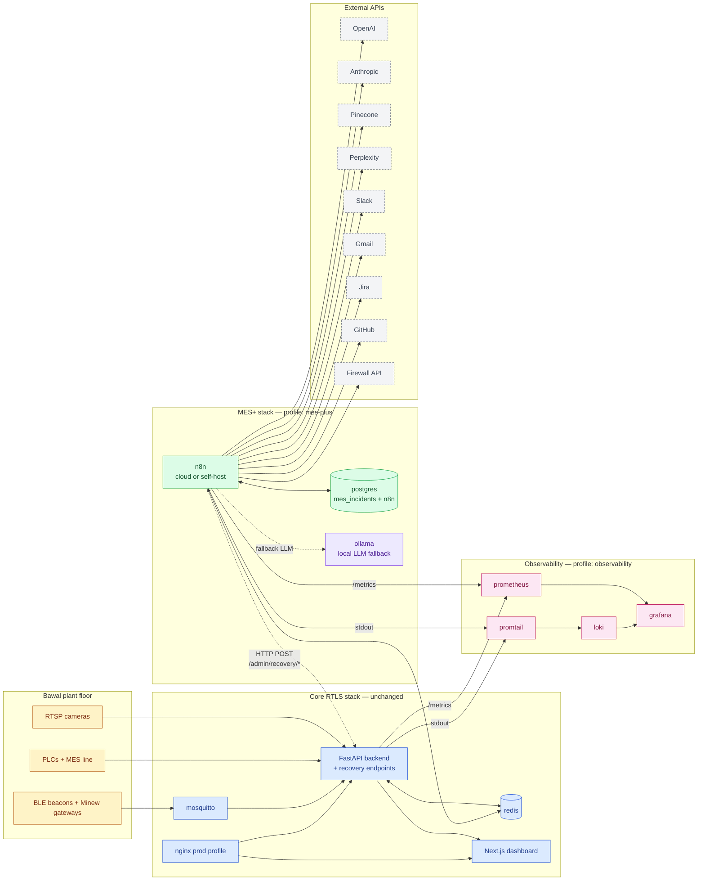
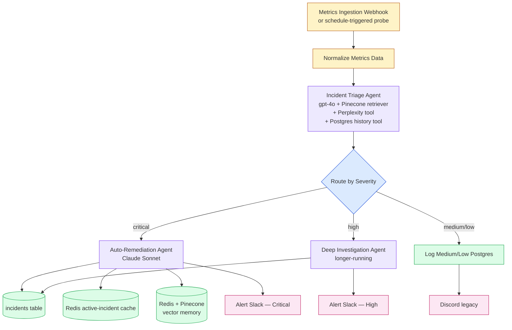
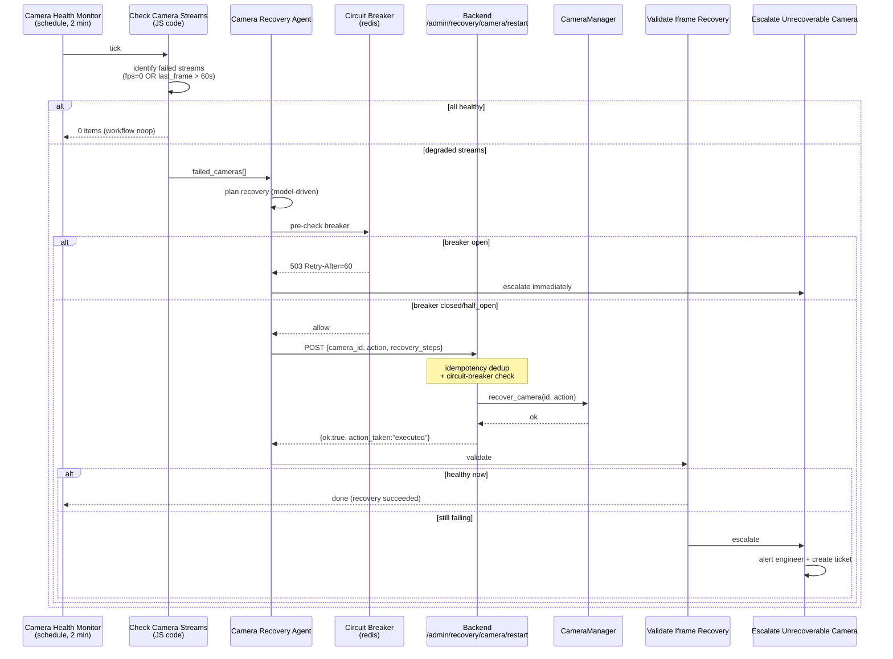
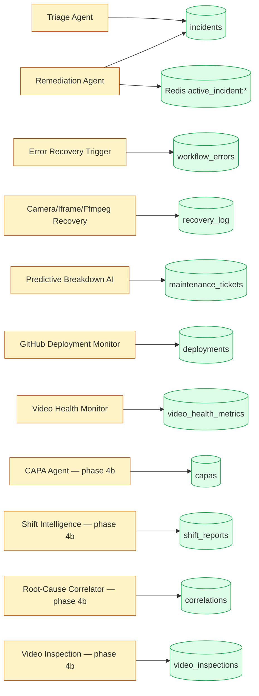

# Architecture — RTLS + MES+ AI self-healing platform

This is the system after Phases 1-5. Original RTLS stack (mosquitto,
backend, frontend, nginx) is unchanged; the **MES+** profile adds the AI
self-healing layer.

## 1. System overview

The arrow from n8n → backend's `/admin/recovery/*` is the **self-healing
loop**: AI detects something → AI decides action → AI calls backend → backend
performs idempotent restart → AI verifies and either declares success or
escalates.

## 2. AI Incident pipeline (main workflow)

## 3. Self-healing flow (camera example — applies to iframe / ffmpeg / process)

## 4. Data flow (what writes where)

## 5. Credential / env-var matrix

| Component | Credential type | Required for | Env var (when self-hosting) |
|---|---|---|---|
| n8n core | encryption key | n8n itself | `N8N_ENCRYPTION_KEY` |
| Postgres (mes_incidents) | username/password | every postgres node | `POSTGRES_PASSWORD` |
| OpenAI | API key | 14 agents + 3 embeddings | `OPENAI_API_KEY` |
| Anthropic | API key | Claude Sonnet model | `ANTHROPIC_API_KEY` |
| Pinecone | API key + index | 2 vector store nodes | `PINECONE_API_KEY`, `PINECONE_INDEX` |
| Perplexity | API key | Real-time Incident Research tool | `PERPLEXITY_API_KEY` |
| Slack | Bot token (`xoxb-`) | 5 alert nodes | `SLACK_BOT_TOKEN` |
| Gmail | OAuth2 | Daily Summary email | `GMAIL_*` |
| Jira | API token + base URL | Security ticket creation | `JIRA_*` |
| GitHub | PAT (read) | Deployment Monitor | `GITHUB_PAT` |
| Discord | Webhook URL | Legacy fallback channel | `DISCORD_WEBHOOK_URL` |
| MES backend | HTTP Header Auth | 4 Execute-*Recovery nodes | `ADMIN_TOKEN` |
| Firewall (optional) | _(none — URL only)_ | Block Malicious IPs node | `FIREWALL_BLOCK_URL` |
| Dashboard webhooks (optional) | _(none — URL only)_ | 2 push nodes | `DASHBOARD_WEBHOOK_URL`, `VIDEO_DASHBOARD_WEBHOOK_URL` |

**Graceful degradation:** rows marked "(optional)" can stay blank. The
corresponding workflow node has `onError: continueRegularOutput` (Phase
2) so the workflow keeps running. AI agent nodes whose model credential
is missing **will halt** that branch — they're not optional.

## 6. Network ports (all configurable in `.env`)

| Service | Default | Env var | Profile |
|---|---|---|---|
| backend | 8000 | `API_PORT` | default |
| frontend | 3000 | `FRONTEND_PORT` | default |
| mosquitto | 1883 | `MQTT_PORT` | default |
| redis | 6379 | `REDIS_PORT` | default |
| nginx | 80/443 | `HTTP_PORT`/`HTTPS_PORT` | prod |
| postgres | 5432 (loopback) | `POSTGRES_PORT` | mes-plus |
| n8n | 5678 | `N8N_PORT` | mes-plus |
| prometheus | 9090 | `PROMETHEUS_PORT` | mes-plus / observability |
| grafana | 3001 | `GRAFANA_PORT` | mes-plus / observability |
| loki | 3100 | `LOKI_PORT` | mes-plus / observability |
| ollama | 11434 | `OLLAMA_PORT` | mes-plus / ai-local |

## 7. Failure-domain isolation

The platform is intentionally compartmentalized so a failure in one
domain can't take down others:

- **AI provider outage** (OpenAI / Anthropic down) → only AI agent
  branches halt; ingestion + dashboard + recovery endpoints keep working.
- **n8n down** → MES dashboard + ingestion keep working; no AI triage
  + no self-healing until n8n is back. Manual recovery via dashboard
  buttons still hits the same `/admin/recovery/*` endpoints.
- **Redis down** → idempotency + circuit breaker fall back to in-memory
  per-process. Self-healing degrades to "best effort" (no cross-worker
  dedup) but still works.
- **Postgres down** (mes_incidents) → workflow writes fail, retries 3×
  then routes to the `Error Recovery Trigger` chain. Backend RTLS keeps
  using SQLite as it always did.
- **Backend down** → Camera/Iframe/Ffmpeg recovery POSTs fail their
  retries → workflow escalates via Slack + Discord. Detection still
  fires.
